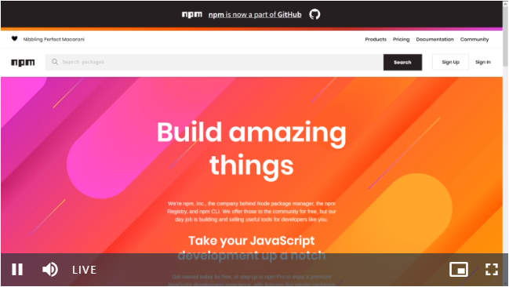

# vue-video-player-vjs
[](https://www.npmjs.com/package/vue-video-player-vjs)

> 根据[surmon-china/vue-video-player](https://github.com/surmon-china/vue-video-player)@5.2.3修改而来，除引入方式外均相同，具体配置或demo请点击链接查看  
> 该组件支持[video.js](https://github.com/videojs/video.js)@7.x.x，可点击链接查看详细  

### 示例
> [demo展示](https://jekorx.github.io/vue-video-player-vjs)


### 用法
```bash
# 安装依赖
yarn add vue-video-player-vjs
# or
npm i vue-video-player-vjs -S
```
> 全局引入，SPA，非SSR
```javascript
import Vue from 'vue'
import VideoPlayer from 'vue-video-player-vjs'
 
// require videojs style
import 'video.js/dist/video-js.css'
import 'vue-video-player-vjs/styles/index.css'
 
Vue.use(VideoPlayer, /* {
  options: global default options,
  events: global videojs events
} */{
  options: {
    languages: {
      // 参考，video.js/dist/lang/zh-CN.json，并增加末尾两行画中画中文
      'zh-CN': {
        'Picture-in-Picture': '打开画中画模式',
        'Exit Picture-in-Picture': '退出画中画模式'
      }
    }
  }
})
```
> 局部引入依赖，SPA，非SSR  
```javascript
<template>
  <div>
    <VideoPlayer
      class="vjs-custom-skin"
      :options="playerOptions"
      :playsinline="true"
    />
  </div>
</template>
<script>
/**
 * 注意：
 * vue-video-player引入方式为
 * import { videoPlayer } from 'vue-video-player
 */
import VideoPlayer from 'vue-video-player-vjs'
import 'video.js/dist/video-js.css'
import 'vue-video-player-vjs/styles/index.css'

export default {
  name: 'App',
  components: { VideoPlayer },
  data () {
    return {
      playerOptions: {
        autoplay: false, // 自动播放，false
        controls: true, // 控制条
        preload: 'auto', // 预加载
        language: 'zh-CN',
        fluid: true,
        notSupportedMessage: '此视频暂时无法播放，请稍后再试',
        // hls直播
        sources: [{
          withCredentials: false,
          type: 'application/x-mpegURL',
          src: 'https://logos-channel.scaleengine.net/logos-channel/live/biblescreen-ad-free/playlist.m3u8'
        }],
        controlBar: {
          timeDivider: false,
          remainingTimeDisplay: false,
          currentTimeDisplay: false,
          durationDisplay: false
        }
      }
    }
  }
}
</script>
```
> 引入依赖，服务端渲染（SSR）中使用，以Nuxtjs为例  
```javascript
// @/plugins/vue-video-player-vjs.js
import Vue from 'vue'
import VideoPlayer from 'vue-video-player-vjs/lib/ssr'
import 'video.js/dist/video-js.css'
import 'vue-video-player-vjs/styles/index.css'

export default () => {
  Vue.use(VideoPlayer, {
    options: {
      languages: {
        // 参考，video.js/dist/lang/zh-CN.json，并增加末尾两行画中画中文
        'zh-CN': {
          'Picture-in-Picture': '打开画中画模式',
          'Exit Picture-in-Picture': '退出画中画模式'
        }
      }
    }
  })
}
// nuxt.config.js
plugins: [
  '@/plugins/vue-video-player-vjs'
]
```
```javascript
<template>
  <!-- SSR 使用组件 -->
  <div class="vjs-custom-skin" :playsinline="true" v-video-player:currentVideoPlayer="playerOptions">
  </div>
</template>
<script>
export default {
  data () {
    return {
      // videojs options
      playerOptions: {
        autoplay: false, // 自动播放，false
        controls: true, // 控制条
        preload: 'auto', // 预加载
        language: 'zh-CN',
        fluid: true,
        notSupportedMessage: '此视频暂时无法播放，请稍后再试',
        // hls直播
        sources: [{
          withCredentials: false,
          type: 'application/x-mpegURL',
          src: 'https://logos-channel.scaleengine.net/logos-channel/live/biblescreen-ad-free/playlist.m3u8'
        }],
        controlBar: {
          timeDivider: false,
          remainingTimeDisplay: false,
          currentTimeDisplay: false,
          durationDisplay: false
        }
      }
    }
  },
  mounted() {
    console.log('this is current player instance object', this.currentVideoPlayer)
  }
}
</script>
```
